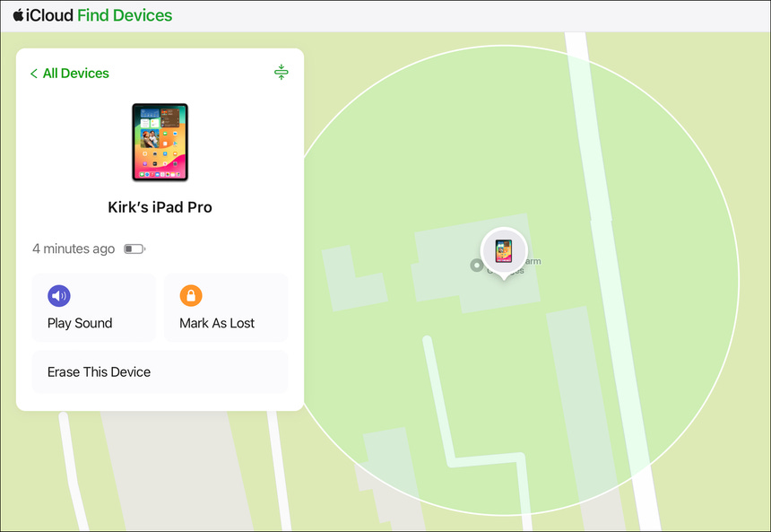

**TLDR**: If you lose your iPhone, don’t trust texts claiming “we found your device”; Scammers are using that message to steal Apple ID logins, unlock the device, and resell it. Also: update Windows and Chrome - big security patches are out now.

## Patch Radar
- [Google Chrome](https://thehackernews.com/2025/11/google-issues-security-fix-for-actively.html): Fixed a high-risk, never-before-seen vulnerability that attackers are exploiting to run code on Android or desktop.
- [Windows](https://thehackernews.com/2025/11/microsoft-fixes-63-security-flaws.html): Microsoft patched 63 vulnerabilities, including an actively exploited privilege escalation bug in the Windows Kernel.

___

## Dangerous “Found iPhone” Phishing Scam
When you lose your iPhone, scammers are stepping in, sending texts that *look like they’re from Apple Support*. They may include details about your device (like model or color) - information that can be seen without unlocking your phone. The text then encourages you to click a link to see your phone’s location that leads to a fake Apple login page.

If you enter your Apple ID credentials, the scammers can gain control over your phone. That means they can remove Find My, stop you from wiping it remotely or locking it, and then resell it.

___

### What to Know
- Never click on unexpected links claiming to be from Apple about a “found” phone (Apple Support will never text you).
- Information like the device model or color can be seen even when your phone is locked.
- The phishing link leads to a Find My page that looks real but isn’t Apple.
- Once they have your login, they can disable your security protections.

### What to Do Now
- Update your iPhone immediately when a new iOS version becomes available.
- If you’re worried about your device, use iCloud.com or the Find My app to lock or wipe it.
- Use a strong, unique Apple ID password (and 2FA), so even if someone gets your login, they can’t easily take over.
- Report suspicious messages to Apple and **do not enter your credentials** unless you are sure it’s legit.
   

[BleepingComputer - "Lost iPhone? Don't fall for phishing texts..."](https://www.bleepingcomputer.com/news/security/lost-iphone-dont-fall-for-phishing-texts-saying-it-was-found/)   

___
   
Losing a phone is stressful, and scammers count on that moment of panic to get you to act without thinking. Take a beat, verify anything that claims to be from Apple, and stick to trusted channels like iCloud.com or the Find My app. A little caution goes a long way toward keeping a bad situation from getting worse.

Stay safe,  
Jaiden
