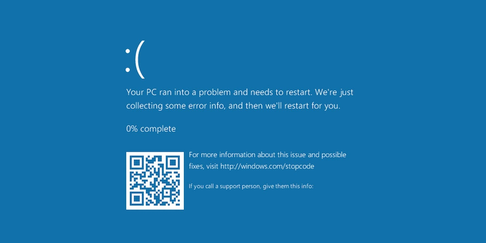

**TLDR**: A new scam shows a fake Windows “blue screen of death” and tells users to paste commands to “fix” their PC - doing so installs malware that gives attackers deep control of the system.

___

  
Credit: [Securonix](https://www.securonix.com/blog/analyzing-phaltblyx-how-fake-bsods-and-trusted-build-tools-are-used-to-construct-a-malware-infection/)

## Fake Blue Error Screens Used to Spread Malware
Cybercriminals are abusing people’s trust in familiar Windows error screens by showing a **fake Blue Screen of Death (BSOD)** and claiming the computer is broken or at risk. The message then gives step-by-step instructions that convince users to open a command window and paste in code to “protect their data.”

This is not a real Windows repair process. It’s a newer version of a long-running scam technique called [ClickFix](https://cybersafebrief.substack.com/p/beware-of-fake-captcha-attacks-do), which relies on social engineering - tricking people into doing the attacker’s work for them.

Once the pasted command runs, the attacker’s malware installs itself deeply into the system and turns off Windows’ defense mechanisms.

___

### What to Know
- A real BSOD appears when Windows crashes and **automatically restarts** - it does not give repair instructions.
- The fake screen tells users to open a command prompt and paste code to “fix” the issue.
- That command:
  - Downloads malware
  - Turns off or avoids Windows Defender
  - Gives itself administrator access
  - Stays installed even after a restart
  - Sends information about your computer back to the attacker, and allows for remote access
- This attack works because it looks urgent and familiar, not because of a software bug.

### What to Do Now
- Never paste commands into your computer because a website or pop-up tells you to.
- If you see a BSOD, let Windows restart on its own - that’s normal behavior.
- If a screen tells you to take manual steps to “save your data,” treat it as suspicious.
- Keep your system and antivirus software up to date.
- If you think you followed these steps already, disconnect from the internet and run a full malware scan, or seek professional help.
   

[BleepingComputer - "ClickFix attack uses Fake BSOD Screens to Push Malware"](https://www.bleepingcomputer.com/news/security/clickfix-attack-uses-fake-windows-bsod-screens-to-push-malware/)   
___
   
Scammers don’t always rely on technical hacks; sometimes they rely on panic and familiarity. The more “official” something looks, the more important it is to slow down and question it.

Stay safe,  
Jaiden
