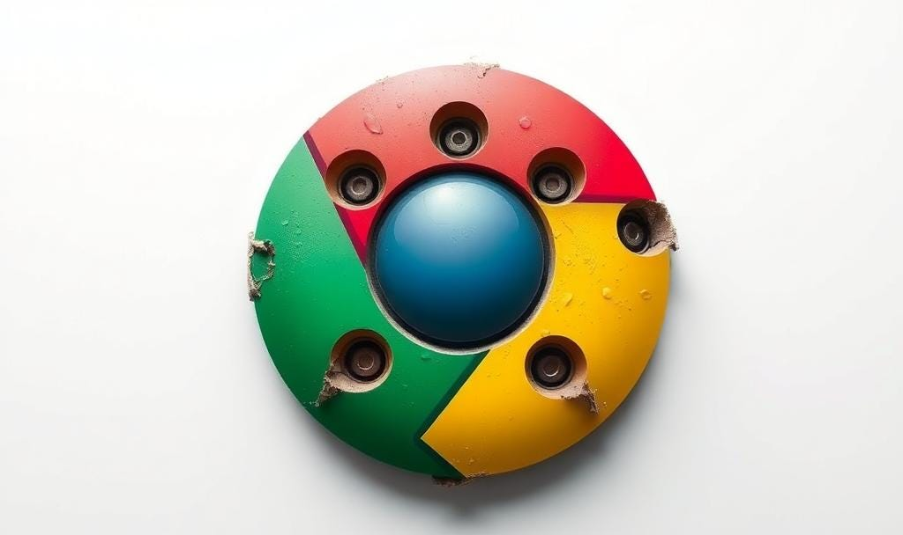

**TLDR**: Update your Chrome browser immediately, and if you use an older iPhone or iPad, make sure you’ve installed Apple’s latest security patch.

## Patch Radar
- [Apple](https://www.bleepingcomputer.com/news/security/apple-backports-zero-day-patches-to-older-iphones-and-ipads/): Released a fix for an actively exploited zero-day affecting older iPhones (X and earlier) and iPads (Pro and earlier). Make sure you’ve updated if you’re running one of these devices.

___

## Chrome Zero-Day Being Actively Exploited
Google has released an emergency update for Chrome after discovering a(nother) new zero-day vulnerability that cybercriminals are already using in attacks. The flaw lets attackers run their own code on your computer and crash programs, opening the door to bigger compromises if left unpatched.

___

### What to Know
- The issue is in Chrome’s code and can let attackers execute arbitrary code (basically, make your computer run their commands).
- Attackers can also use it to crash programs and cause instability.
- This is the **sixth Chrome zero-day this year**, a reminder that browsers are one of the biggest attack targets.

### What to Do Now
- Update Chrome on your desktop immediately. (Click the three dots > Help > About Google Chrome > it will auto-update).
- Restart the browser after updating so the fix takes effect.
   

[TheHackerNews - "...Chrome Zero-Day...Threatens Millions"](https://thehackernews.com/2025/09/google-patches-chrome-zero-day-cve-2025.html)   

___
   
With browsers and mobile devices under constant attack, keeping your software updated is one of the simplest yet most effective defenses. Take a moment today to check for updates - you might just thank yourself later.

Stay safe,  
Jaiden
